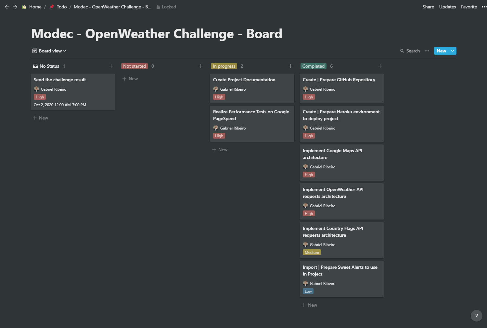

    <h1>Hey! Welcome to my OpenWeather Challenge</h1>

    

 
 

    
    &nbsp;&nbsp;&nbsp;&nbsp;&nbsp;
    

 
 

Here I will explain more about my experience doing this challenge, what technologies that I used, plugins and other things.
 
 
Ok, so... Let's to the points!
 
 

 
 

    
    <h2>Description</h2>

 

This application is focused on get the weather of a City.
The user put a pin on the location that he wants to know the weather, click on the button "Search", then the nearest Cities appear and he can chose one to see the weather.
 
 

 
 

    
    <h2>Technologies</h2>

 

I'll list here all of the technologies that I used to create this application, including frameworks and plugins.

<ul>
    <li>
        <h3>ReactJs</h3>
        To start, I used React Js to do all issues of the challenge (I also did some projects using React, it's an easy and powerful framework)
    </li>
     
    <li>
        <h3>Git && GitHub</h3>
        To control my code versions, I used git, specifically talking about GitHub that's a good platform and is being bigger every year.
        I used only two branches for this project, "master" and "development".
    </li>
     
    <li>
        <h3>React Router</h3>
        This React plugin is a powerful plugin to give your application the total control about routes, URLs, parameter pass and more.
        Version used: The "newest" - v6 (With useNavigate and other new good functions)
    </li>
     
    <li>
        <h3>React Hooks</h3>
        React Hooks brought to React many facilities that before we spend some time with. (useEffect for example, props through function params... Now we can create components based only in functions easily)
    </li>
     
    <li>
        <h3>Axios</h3>
        I think this is the best plugin for HTTP request, I use it in all of my projects (since in personal mobile applications that I already did with React Native)
    </li>
     
    <li>
        <h3>Google Maps API (google-map-react)</h3>
        The most popular API to use a map.
    </li>
     
    <li>
        <h3>Country Flags API</h3>
        To get country flags on map click, I used this amazing API that return a flag based on the attributes that you add in URL.
        You can access this API <a href="https://www.countryflags.io/">here</a>
    </li>
     
    <li>
        <h3>React Select</h3>
        A simple combobox component that I used to change temperature measure.
    </li>
     
    <li>
        <h3>Sweet Alerts</h3>
        It is a good and simple plugin to show beautiful modal with some data inside.
        In this project, I used to show a message error when the user click on "Search" button and the application get some problem with the response.
    </li>
     
    <li>
        <h3>Heroku</h3>
        I used Heroku to host this application because I think is a good and safe platform and because I want you to put hands-on and test yourselves.
         
         
        <h4>Note:</h4>
        I used Heroku Continuous Integration (CI) with GitHub repository, then when I push some new implementations, application version or whatever on the branch "master", in this moment Heroku start their job and deploy a new application version. 
    </li>
</ul>

 
 

 
 

    
    <h2>Workflow | Agile Methodology</h2>

 

I already used Jira, Trello and other project management tools with agile methodology, but for this project I used one of the best organization frameworks that I know, It's called Notion. I added a board with all of the pending ticket / tasks. See the image below about my organization for this project.

 

    

 
 

 
 

    
    <h2>How to Run</h2>

 

My code is on <a href="https://github.com/gabrielcarreiraribeiro/react-open-weather-challenge-modec">this</a> GitHub repository.
 
 
Like I said, the application is hosted on Heroku, and you can access clicking on this button below.
 
 

    <a href="https://react-open-weather-challenge.herokuapp.com/">
        
OpenWeather Challenge

    </a>

 
 

 
 

    
    <h2>Performance Test</h2>

 

To test my websites I use Google PageSpeed tester, it show exactly the points that your application need to improve.
To test my OpenWeather Challenge, click <a href="https://developers.google.com/speed/pagespeed/insights/?hl=pt-br&url=https%3A%2F%2Freact-open-weather-challenge.herokuapp.com%2F&tab=desktop">here</a> .

 
 

 
 

    
    <h2>Considerations</h2>

 

First of all, I want to thank Modec for the invitation to participate in this challenge, I'm very happy about the result.
 
I like ReactJS, I think this is a good framework to develop websites and I'm very comfortable to work with. Actually I don't use on my work, already used for some projects and did some personal projects with it too. 
 
I'm very excited about the next steps and challenges.
 
 
Good bye and see you soon!
 
 
Regards,
 
Gabriel Ribeiro.
